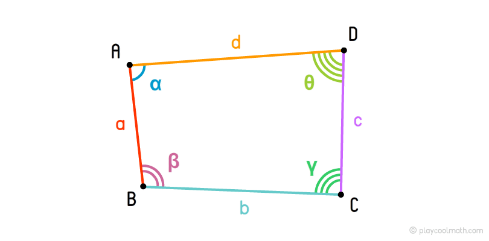

Source: [playcoolmath](https://playcoolmath.com/en/math-lessons/math-for-kids/basic-geometric-shapes/quadrangles)

# QUADRANGLEZ

This fast-paced browser game pits the user against the Quadrangler, a villain known for mysterious angles and greek lettering. Selecting a mysterious angle will allow you to learn more about it's value, but you must learn click, for your score is ascending with each click. Match the Magical Quadrangle with your Mysterious Score and you've won the game, Bravo! Should your score go to high, and it's curtains for you! Luckily, you'll get another chance to prove your worth.

## How do I Play?

This game is live, and [deployed on GitHub](https://fermenting.github.io/unit-4-game/) right now! 

### Prerequisites

This is a browser-based game, tested on Chrome Version 70.0.3538.102.


## Notes on Development

This is one of the first coding projects I've been able to complete on time. It has been a very gratifying process, and I'm happy that it works. That being said, I would like to refine the code and make it run smoother. But hey, it works!

I built the entire game but wasn't able to get it to play until I created a function to check if the game had been won. I run this function on every click to check the state of the game.

```
function winCheck() {
  if (playerScore === targetValue && playerScore != 0) {
    $("#result").text("You found the Magical Angle! Keep going!");
    wins++;
    $("#wins").text(wins);
    newGame();
  }
  if (playerScore > targetValue) {
    $("#result").text("Your Angle was too large. Let's try it again.")
    losses++;
    $("#losses").text(losses);
    newGame();
  }
};
```

## Built With

* [Jquery](https://code.jquery.com/) - Game logic and efficient syntax.
* [BootStrap](https://getbootstrap.com/) - Prefab CSS styling.
* [Google Fonts](https://fonts.google.com/) - For custom fonts.

## Authors

Lyle A. Xander Farrell

## License

This project is licensed under the MIT License - see the [LICENSE.md](LICENSE.md) file for details

## Acknowledgments

I Couldn't have done this without the instruction from the UC Berkeley Extension, particularily:
* Jerome Chenette, Instructor
* Jimmy Tu, TA
* Sasha Patsel, TA
* Jackson Sabol, Helpful Non-Sequitors
* Pete Widders, Esprit de Corps
* Jacob Moore, Genuine Good Advice
